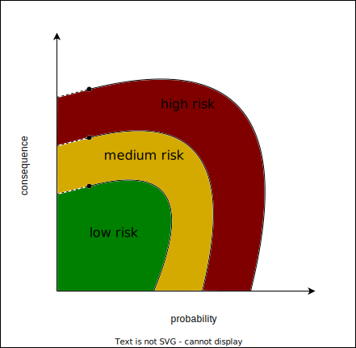
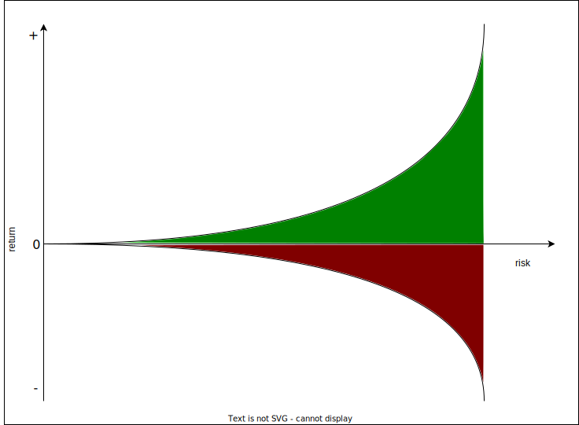

# Intuition 
to be made 


## Investments 
to be made 

### Risk Management and Returns 
Risks are all about chances of future events, more specifically, chances of negative future events. In finance we always try to manage the negative impacts events might have on our investments. Take for example a coin flip. There are two possible outcomes: heads or tails. Each has a 50% chance of happening. In our example we maybe want to avoid flipping tail because we can lose 50 euros, while we win 50 euro if we get head. We therefore adjust the coin so that the probability of flipping tails will decrease. Adjusting your exposure to risk is what we call risk management. <b>The main goal of risk management is that if the event occurs we can live with the loss. </b> The idea is therefore that you set your own risk appetite (what are you willing to lose?). 


The general notion about risk with respect to age is that as we grow older we should take less risks as the consequence of a bad event has a larger impact on your financial well-being. 


Note that there are two dimensions when talking about risk (see graph): 
* the severity of the loss if the event occurs 
* the probability of the event 




The most precarious risks for an investment are the one's with low probability and high consequence. The main reason for this is that the risks are not observed as much and thus estimating the probability of occurrence is rather difficult. Also, we humans tend to be irrational when dealing with risks {cite}`montibeller2015cognitive`. We generally over/underestimate them and are therefore overexposed to them or overprotected from them {cite}`Slovic2004`.

````{tab-set}
```{tab-item} Question 
Frank has 1000 € and is faced with a dilemma. He is at the casino and can put his money on one of the following three bets: 

* Placing his bet on the even numbers. Future events are: 
    * winning 55% of the bet if even is drawn
    * losing 40% if this is not the case.
* Placing his bet on the low numbers (until 6). Future events are: 
    * winning 50% of the bet when won 
    * losing 35% when lost. 
* Placing his bet on the red cards. Future events are: 
    * winning 50% of the bet when red is drawn
    * losing 40% if the reverse is true. 

Whet should he do {cite}`klos2005investment`? 
```
```{tab-item} Answer 
Frank should asks himself: is the risk worth the reward? This all depends on the consequences and the likelihood of the consequences. We have summed this up in the next graph. 


As you can see, placing your bets on the red cards gives you the best reward compared to the risk you take. If Frank would play this game repeatedly,  the third bet would give him the best return compared to the risk taken. 
```
````
Returns are always expressed as an percentage of the initial investment and always refer to a certain time period.
Returns are coherently linked with risks: The higher the risk the higher the return. You can imagine it as in the following graph. 


As the risk increases so does the variability of the returns. This is called volatility and it is the main measurement of risk. In the stock market we can measure the risk of a stock by analyzing the fluctuations of the daily returns. 


In the next subsection we will talk about interest rates which are a kind of return generally discussed with bonds/obligations. 

### Interest Rate 

Interest rates are a percentage of an initial capital and are calculated on a time horizon. For example 
a yearly interest rate of two percent on an initial capital of 1 000 euro will amount to 20 euro after one year, while a monthly interest rate of four percent for the same capital will return 40 euro per month. It is therefore important to remember two questions when faced with interest rates:

* On what time horizon is the interest rate calculated on? 
* To which initial capital does the interest rate refer to?

````{tab-set}
```{tab-item} Question 
what is a better investment? 
* 10% yearly interest rate on a 10 000 euro investment 
* 2% monthly interest rate on a 5 000 euro investment 

```

```{tab-item} Answer 
To compare the two option we first need to set the monthly interest rate to the yearly interest rate. This is done by multiplying 1.02 12x times 

$$ 1.02^{12} \approx 1.27 $$ 

Know we know that the monthly interest rate is actually 2.7x times larger then the 10% yearly interest rate. Option two becomes therefore more attractive, but we still have to account for the initial capital: 


$$ 1.10 * 10000 = 11000 $$ 
$$ 1.27 * 5000  = 6350 $$

The second investment option actually gives us 350 euro more in return and that with a lower initial investment! 
 ``` 
````


### Inflation 

Inflation is the devaluation of currency. If today your 1€ can buy you x amount of goods and tomorrow your 1€ can buy x-1 goods then we speak of inflation. Inflation is good for debt and bad for <b>capital in currency </b>. Let's assume you have 1000 euro in debt, 1000 euro in a deposit and you earn 100 euro. know assume that you have 5% inflation such that also your wage increases with 5%. Then your assets and liabilities will change over time as it is depicted on the graph. 


As you can see the initial capital and debt are almost reduced due to the 5% inflation while your wage generated the bulk of your capital. 


### The Monetary Economy 


$$ M V = Q P $$ 


## Income 
To be made 

## Spending 
To be made


## Bibliography 
```{bibliography}
```