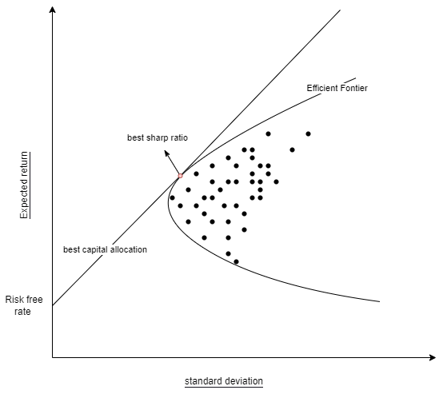

# Theory
In this subsection each financial planning tool is fully explained. 
## Modern Portfolio Theory (MPT)

Modern Portfolio Theory is all about minimizing the variance of the portfolio while taking into account the return with some risk-preference. We therefore need to calculate first the returns of the portfolio and the covariance matrix of the portfolio. 


The expected return of the portfolio is calculated: 
```math 
E(R_P) = \sum_iw_iE(R_i)
```

where $R_P$ is the return of the portfolio, $R_i$ is the return on the asset $i$ and $W_i$ is the weight of asset $i$ in the portfolio is equal to $\sum_i w_i = 1$.  
Next, the variance of the portfolio can be expressed as follows : 

```math
\sigma^2_P  = \sum_i\sum_j w_iw_j\sigma_i\sigma_j\rho_{ij}
```
In matrix notation this becomes: 

```math
\sigma^2_P =  w'\Sigma w  
``` 

What we want to know is that for a given number of stocks which combinations is the most preferential. To achieve this we minimize the variance and take into account our risk-preference $P$ with respect to returns *based on some historic data*. 
We therefore minimize the following cost function: 

```math 
Min(w'\Sigma w - P * E[R_p]) 
```

given the following constraints: 

```math
 w_1 + w_2 + ... + w_{n-1} + w_{n} =1
```

```math
 0> w_i > 1  
```

We solve this optimal design problem using the [Interior point Newton algorithm](https://en.wikipedia.org/wiki/Interior-point_method) from the [Optim.jl package](https://julianlsolvers.github.io/Optim.jl/stable/#)

The only parameter is our risk-preference $P$. For each risk-preference $P$ there is an optimal combination of stock that minimizes our cost function. This creates the efficient frontier 

### The efficient frontier 
The upward sloped portion of the hyperbola is the efficient frontier. It reflects the best *expected* level of return for its level of risk as you will get the maximum amount of return with the least amount of variance for your portfolio. 

  


### Sharp ratio 
We can use the sharp ratio to see how well the return of the portfolio/asset compensates you for the risk that you take. The sharp ratio does however not take into account all risks involved and has the same limitations apply here as for the tool. 


```math 
 S_P = \frac{E[R_P - R_{b}]}{\sigma_P} 
``` 

where $R_b$ is the return of the baseline "risk-free" product. 
### Limitations 

There are three main limitation to this tool. The first limitation is that the MPT is a historical measurement of the portfolio performance. It does not say anything about future performance of the portfolio. Different Macro-economic situations might lead to total different end results. The second issue is that the tool is based on the expected return and variance of the portfolio. This captures the risk return relationship quite well but it does not take into account [skewness](https://en.wikipedia.org/wiki/Skewness) and [tail risk](https://en.wikipedia.org/wiki/Tail_risk). It therefore gives rise to a reduced volatility and an inflated growth rate for a portfolio. Lastly, the risk measurement is probabilistic in nature. It does not reflect the structural roots of the risk. For example, the risk of a stock are off a total different nature then that of a commodity, but to tool will still account for them the same way. 


### Adaptations 

The cost function can be altered if the function stays convex. We can therefore adapt our cost function to account for more precise measurements of risk. One of the most popular adaptions is the Post-Modern Portfolio Theory (PMPT). 

The current tool only implements the MPT. Future work will enable PMPT and other adaptions to be made possible. 


### Recommendations of usage 
Never use this tool for individual stock picking and never but then also never rely *only* on the MPT. Always do your due diligence before creating your portfolio and again this is no way or form financial advice. 

So why should you use this tool and for what purpose? It is highly recommended to use this tool with exchange traded funds (ETF) as these products are already substantially diversified and issue two of the MPT is therefore greatly diminished. Also, the structural risk that certain ETF are exposed is difficult the estimate and the MPT can help you gain insights into which ETF have less or more risk compared to the returns they offer. Lastly, MPT also works better if you invest in all assets classes as each class has risks of a different nature and you are then therefore not fully exposed to one particular kind of risk. 

To know which portfolio weights you should apply, you have to understand your risk preference. If you do not want to take a lot of risk, it is beneficial to look at optimal portfolio's with low value in $P$. The reverse is true for people who are risk seeking. 


## to be developed 

#### Post-Modern Portfolio Theory 

##### Sortino ratio 

### Captial asset pricing model (CAPM) 


### Optimal control of spending, saving and investment 


