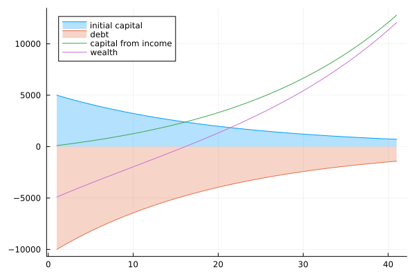

# Fundamental Understanding

In this subsection of the book we delve deeper into the main concepts behind financial planning. The general intuition will be given in the first part of this section, while in the last section the theoretical aspects will be discussed. It is highly recommended to at least **understand** the intuitional part of the fundamentals as this will enable you to better account for the limitations and the context of each tool. 


> Financial planning is like learning how to drive. Know the traffic rules and start in the parking lot. 


## Intuition 
Financial planning has three main area's of focus: income, spending and investment/savings. These three area's are linked with each other: 


Income is the money that you earn from you wage. This income is then subdivided in your savings and expenditures depending on your spending behavior. Consequentially, a part of the savings is invested into different kinds of assets. Depending on the risk you take, these assets will return a certain profit or loss. In each subdomain we can optimize choices in a way that benefits your financial well-being. The fundamental context around these area's will be explained in the following sections. 

### Investments 
Investments are important. They are the corner stone of planning your financial well-being. It is however not easy to decide on what you should invest in exactly. A whole industry is build around that question and it becomes even harder when you take into account the ramifications of those decisions. It is therefore paramount to fully understand the options available and the possible caveats. The investment decision is the most difficult one you will make and most of the financial planning tools will therefore revolve around it. 

In this subsection, however, a small introduction to the basic concepts in investment is given. For a more in depth discussion see the technical explanation.    


#### Risk Management and Returns 
Risks are all about chances of future events, more specifically, chances of negative future events. In finance we always try to manage the negative impacts events might have on our investments. Take for example a coin flip. There are two possible outcomes: heads or tails. Each has a 50% chance of happening. In our example we maybe want to avoid flipping tail because we can lose 50 euros, while we win 50 euro if we get head. We therefore adjust the coin so that the probability of flipping tails will decrease. Adjusting your exposure to risk is what we call risk management. **The main goal of risk management is that if the event occurs we can live with the loss. ** The idea is therefore that you set your own risk appetite (what are you willing to lose?). 


The general notion about risk with respect to age is that as we grow older we should take less risks as the consequence of a bad event has a larger impact on your financial well-being. 


Note that there are two dimensions when talking about risk (see graph): 
* the severity of the loss if the event occurs 
* the probability of the event 


The most precarious risks for an investment are the one's with low probability and high consequence. The main reason for this is that the risks are not observed as much and thus estimating the probability of occurrence is rather difficult. Also, we humans tend to be irrational when dealing with risks. We generally over/underestimate them and are therefore overexposed to them or overprotected from them.


Returns are always expressed as an percentage of the initial investment and always refer to a certain time period.
Returns are coherently linked with risks: The higher the risk the higher the return. You can imagine it as in the following graph. 


As the risk increases so does the variability of the returns. This is called volatility and it is the main measurement of risk. In the stock market we can measure the risk of a stock by analyzing the fluctuations of the daily returns. 


In the next subsection we will talk about interest rates which are a kind of return generally discussed with bonds/obligations. 

#### Interest Rate 

Interest rates are a percentage of an initial capital and are calculated on a time horizon. For example 
a yearly interest rate of two percent on an initial capital of 1 000 euro will amount to 20 euro after one year, while a monthly interest rate of four percent for the same capital will return 40 euro per month. It is therefore important to remember two questions when faced with interest rates:

* On what time horizon is the interest rate calculated on? 
* To which initial capital does the interest rate refer to?


#### Inflation 

Inflation is the devaluation of currency. If today your 1€ can buy you x amount of goods and tomorrow your 1€ can buy x-1 goods then we speak of inflation. Inflation is good for debt and bad for **capital** . Let's assume you have 1000 euro in debt, 1000 euro in a deposit and you earn 100 euro. know assume that you have 5% inflation such that also your wage increases with 5%. Then your assets and liabilities will change over time as it is depicted on the graph. 



As you can see the initial capital and debt are almost reduced due to the 5% inflation while your wage generated the bulk of your capital. 


### Income 
To be made 

### Spending 
To be made


### Bibliography 
```{bibliography}
```